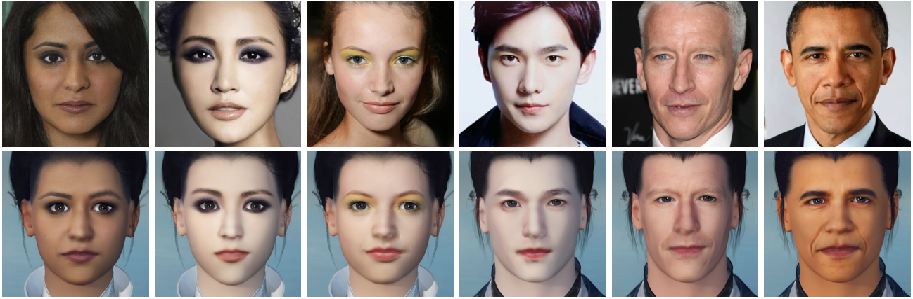
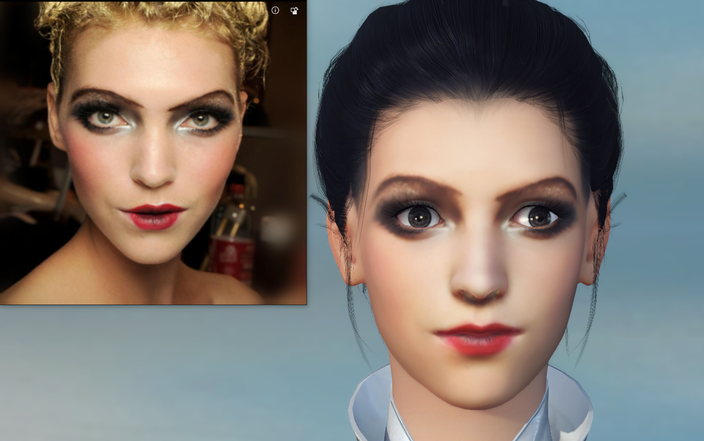

## MeInGame: Create a Game Character Face from a Single Portrait ##

<p align="center"> 

</p>


This is the official PyTorch implementation of the AAAI 2021 paper:
J. Lin, Y. Yuan, and Z. Zou, [MeInGame: Create a Game Character Face from a Single Portrait](https://arxiv.org/abs/2102.02371), the Association for the Advance of Artificial Intelligence (AAAI), 2021.

### 3D display of the created game characters ([click to view](https://youtu.be/597cvKOegfE)): ###
[](https://youtu.be/597cvKOegfE)

## Getting Started
### Requirements ###

- The code runs on both Windows and Linux.
- For compatibility reasons, we use CUDA 10.0, PyTorch 1.4 and Tensorflow 1.14.
- [Basel Face Model 2009 (BFM09)](https://faces.dmi.unibas.ch/bfm/main.php?nav=1-0&id=basel_face_model). 
- [Expression Basis (transferred from Facewarehouse by Guo et al.)](https://github.com/Juyong/3DFace).
- [A modified version of PyTorch3D](https://github.com/Agent-INF/pytorch3d/tree/3dface). Since there is a [bug](https://github.com/facebookresearch/pytorch3d/issues/192) of boardcasting in the official version, we use our modified version.

### Install Dependencies ###

```bash
pip install torch==1.4.0+cu100 torchvision==0.5.0+cu100 -f https://download.pytorch.org/whl/torch_stable.html
pip install opencv-python fvcore h5py scipy scikit-image dlib face-alignment scikit-learn tensorflow-gpu==1.14.0 gast==0.2.2
pip install "git+https://github.com/Agent-INF/pytorch3d.git@3dface"
```

## Testing with pre-trained network

1. Clone the repository 

```bash
git clone https://github.com/FuxiCV/MeInGame
cd MeInGame
```

2. Prepare the Basel Face Model following thet instructions on [Deep3DFaceReconstruction](https://github.com/microsoft/Deep3DFaceReconstruction#testing-with-pre-trained-network), and rename those files as follows:
Deep3DFaceReconstruction/BFM/BFM_model_front.mat -> ./data/models/bfm2009_face.mat
Deep3DFaceReconstruction/BFM/similarity_Lm3D_all.mat -> ./data/models/similarity_Lm3D_all.mat
Deep3DFaceReconstruction/network/FaceReconModel.pb -> ./data/models/FaceReconModel.pb

3. Download the pre-trained [model](https://drive.google.com/drive/folders/10YG_18w5nCS889WsfBB4AZxBNHnTP4Xn?usp=sharing), put the .pth file into ./checkpoints/celeba_hq_demo subfolder, and the .pkl file into ./data/models subfolder.

4. Run the code.

```
python main.py -m test -i demo
# Or
python main.py -m test -i demo -c
# it will run on the CPU, if you don't have a qualified GPU.
```

5. ./data/test subfolder contains several test images and ./results subfolder stores their reconstruction results. For each input test image, serveral output files can be obtained after running the demo code:
  - "xxx_input.jpg": an RGB image after alignment, which is the input to the network
  - "xxx_neu.obj": the reconstructed 3D face in neutral expression, which can be viewed in MeshLab.
  - "xxx_uv.png": the uvmap corresponding to the obj file.


## Training with CelebA-HQ dataset
### Data preparation ###
1. Run following command to create training dataset from in-the-wild images.
```
python create_dataset.py
# You can modify the input_dir to your input images directory.
```

2. Download our [RGB 3D face dataset]() (TBA), unzip it, and place it into the ./data/dataset/celeba_hq_gt subfolder.

### Training networks ###
After the dataset is ready, you can train the network with the following command:
```
python main.py -m train
```

## Citation

Please cite the following paper if this model helps your research:

	@inproceedings{lin2021meingame,
	    title={MeInGame: Create a Game Character Face from a Single Portrait},
	    author={Lin, Jiangke and Yuan, Yi and Zou, Zhengxia},
	    booktitle={Proceedings of the AAAI Conference on Artificial Intelligence},
	    year={2021}
	}